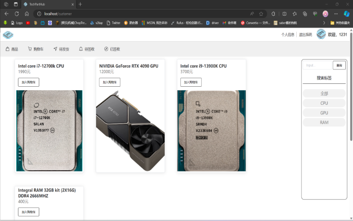
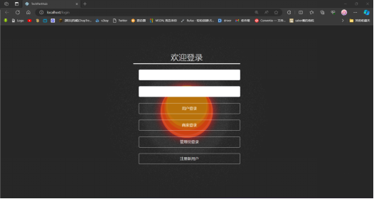

# **TechPartHub: 电脑配件一站式购物平台**





## 1. 参与人员

| 序号 | 学号         | 姓名   | 专业     | 工作内容概述                                                 |
| ---- | ------------ | ------ | -------- | ------------------------------------------------------------ |
| 1    | xxxxxxxx | xxx | 计算机澳 | 负责项目的整体规划、分工协调和进度跟踪。同时也负责测试工作，确保软件的质量和性能。 |


## 2.环境配置

- SpringBoot
- Node.js(在这个项目主要管理vue组件和其依赖)
- VUE
- MySQL

在vue目录下运行

```
npm run install
```

来安装Echart , Element UI等依赖

## 3.运行项目

### 3.1后端运行

**一、直接运行**

用idea打开项目直接启动

**二、打包运行**

输入：

```
mvn package 
```

并启动生成的.jar文件

### 3.2前端运行

**一、热启动**

在vue文件夹下输入：

```
npm run serve
```

**二、打包后再运行**

```
npm run build
```

